<h1 align=center><b>Introducción a la Secuenciación de Nueva Generación</b></h1>
 
<h2 align=center><b>Manual de instalación de las herramientas necesarias para el taller</b></h2>
 
 

El siguiente manual es una guía básica para la instalación de las herramientas necesarias para crear un pipeline completo de Secuenciación de Nueva Generación (NGS por sus siglas en inglés) durante el taller. Para ello se requiere contar con un ambiente o sistema operativo basado en Unix, ya sea una de las distribuciones para Linux (Ubuntu, Debian, Kali, Arch, etc..) o MacOS. En caso de contar con sistema operativo Windows, se sugiere tener un double boot system con Linux, o instalar WSL.

 
<h2 align=left><b>Atención: SOLO para participantes con sistema operativo Windows</b></h2>
 
<h2 align=left><b><u>Instalar WSL (Windows Subsystem for Linux):</u></b></h2>
<h2 align=left><b>¿Qué es el Subsistema de Windows para Linux?</b></h2>

El Subsistema de Windows para Linux permite a los desarrolladores ejecutar un entorno de GNU/Linux, incluida la mayoría de herramientas de línea de comandos, utilidades y aplicaciones, directamente en Windows, sin modificar y sin la sobrecarga de una máquina virtual tradicional o una configuración de arranque dual.

Se puede hacer lo siguiente:
<lu>
<li>Elige tus distribuciones de GNU/Linux favoritas de Microsoft Store.</li>
<li>Ejecuta herramientas comunes de línea de comandos, como grep, sed, awk.</li>
<li>Ejecuta scripts de shell de Bash y aplicaciones de línea de comandos de GNU/Linux.</li>
<li>Instala software adicional mediante el administrador de paquetes de distribución de GNU/Linux.</li>
<li>Invoca aplicaciones de Windows mediante un shell de línea de comandos de tipo UNIX.</li>
<li>Invoca aplicaciones de GNU/Linux en Windows.</li>
<li>Ejecución de aplicaciones gráficas GNU/Linux que están integradas directamente en el escritorio de Windows.</li>
<li>Uso de la aceleración de GPU para el aprendizaje automático, escenarios de ciencia de datos y mucho más.</li>
</lu>

 
 
<h2 align=left><b><u>Instalación:</u></b></h2>
 
<h2 align=left><b>Buscar y abrir una ventana de la PowerShell de Windows. </b></h2>

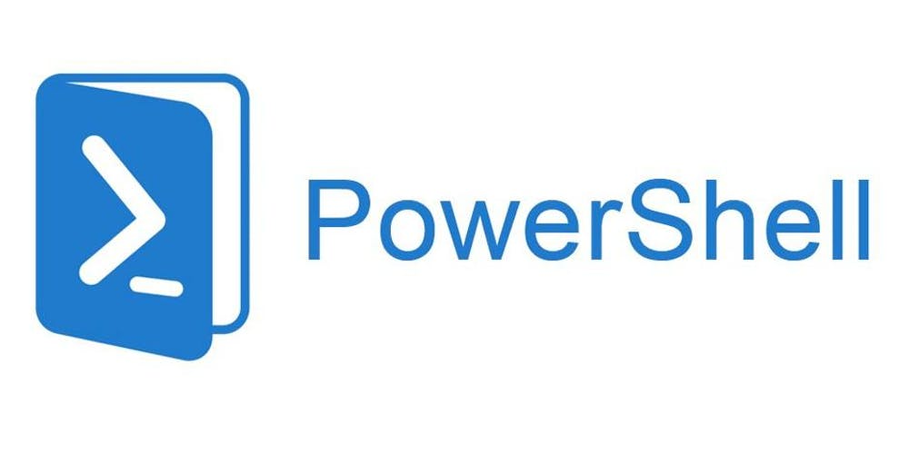

 
<h2 align=left><b>Instalar WSL escribiendo “wsl --install” y presionar Enter.</b></h2>

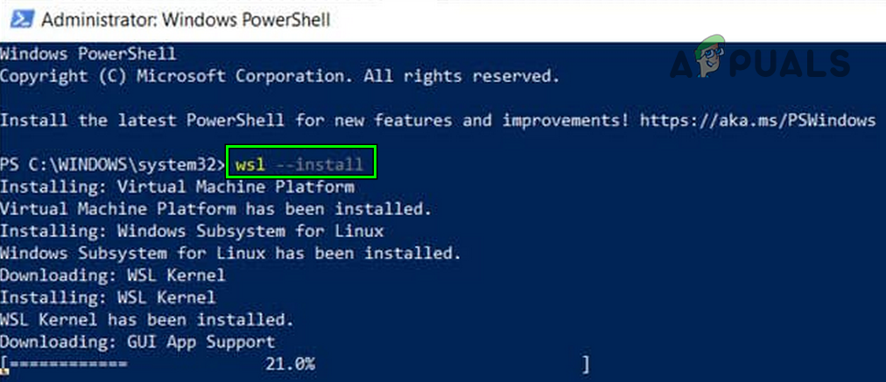

El comando --install realiza las acciones siguientes:
<lu>
<li>Habilita los componentes opcionales de WSL y Plataforma de máquina virtual.</li>
<li>Descarga e instala el kernel de Linux más reciente.</li>
<li>Establece WSL 2 como valor predeterminado.</li>
<li>Descarga e instala la distribución de Ubuntu Linux (es posible que sea necesario reiniciar).</li>
</lu>

 

Generalmente, las últimas versiones del sistema operativo Windows ya cuentan con WSL instalado y al correrl el comando "wsl --install" este despliega la documentación de ayuda, lo que indica que no es necesario su instalación y se puede continuar con la carga de la distribución de Linux deseada. En pocas palabras, puedes continuar.

 
<h2 align=left><b>Habilitar el subsistema de Linux en Windows</b></h2>

Presiona la tecla con el símbolo de windows al mismo tiempo que la tecla "R". Esto abrirá una ventana de búsqueda donde debes ingresarlo siguiente: <i><b>optionalfeatures.exe</b></i> donde se muestra la ventana para activar o desactivar características de windows. Acá te vas a desplazar buscando la característica "Subsistema de Windows para Linux" para habilitarla y finaliza haciendo click en aceptar. Al final de esto, Windows te pedirá reiniciar al sistema para que los cambios tengan efecto.

 

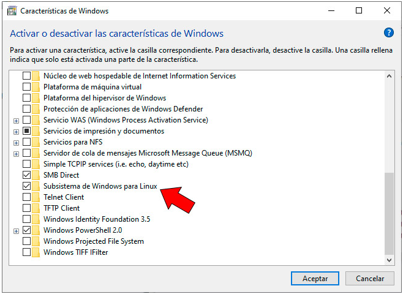

<h2 align=left><b>Abrir la terminal de Linux</b></h2>

Una vez completado el proceso de instalación de la distribución de Linux con WSL, abra la distribución (Ubuntu de forma predeterminada) mediante el menú Inicio, o buscando la palicación en Microsoft Store para descargar e instalar.

 

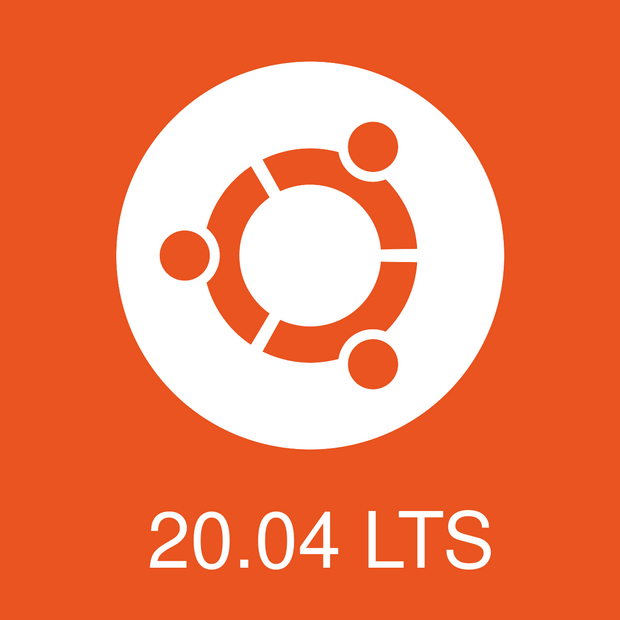

 

Se le pedirá que cree un nombre de usuario y una contraseña para la distribución de Linux.
 

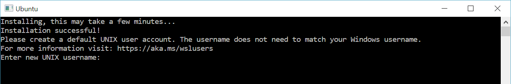

 
<lu>
<li>El nombre de usuario y la contraseña son específicos de cada distribución de Linux individual que instala y no tienen relación con su nombre de usuario de Windows.</li>
<li>Tenga en cuenta que mientras escribe la contraseña, no aparecerá nada en la pantalla. Esto se denomina escritura ciega. No verá lo que está escribiendo, esto es completamente normal.</li>
<li>Cuando haya creado el nombre de usuario y la contraseña, la cuenta será el usuario predeterminado de la distribución e iniciará sesión automáticamente al inicio.</li>
<li>Recuerda que esta cuenta se considerará el administrador de Linux y tendrá la capacidad de ejecutar comandos administrativos sudo (es decir, de superusuario).</li>
<li>Cada distribución de Linux que se ejecuta en WSL tiene sus propias cuentas de usuario y contraseñas de Linux. Tendrás que configurar una cuenta de usuario de Linux cada vez que reinstales, restablezcas o agregues una distribución.</li>
</lu>

<h3 align=left><b>Fuente: </b><a href="https://learn.microsoft.com/es-es/windows/wsl/setup/environment">https://learn.microsoft.com/es-es/windows/wsl/setup/environment</a>.</h3>
<h3 align=left><b>Youtube: </b><a href="https://www.youtube.com/watch?v=EIhzKQOR4vw">https://www.youtube.com/watch?v=EIhzKQOR4vw</a>.</h3>
<h3 align=left><b>Tutorial: </b><a href="https://www.youtube.com/watch?v=EIhzKQOR4vw">https://www.neoguias.com/activar-terminal-linux-windows-10/</a>.</h3>
 
<h2 align=left><b>Para TODOS los participantes</b></h2>
 
<h2 align=left><b>Descargar este repositorio</b></h2>

El primer paso es descargar el contenido de este repositorio haciendo click en el botón "CODE" de color verde que se enceuntra en la esquina superior derecha, y luego haces click en "Download ZIP". Se descargará un archivo comprimido en formato .zip, el cual puedes descomprimir para tener acceso a todo su contenido.

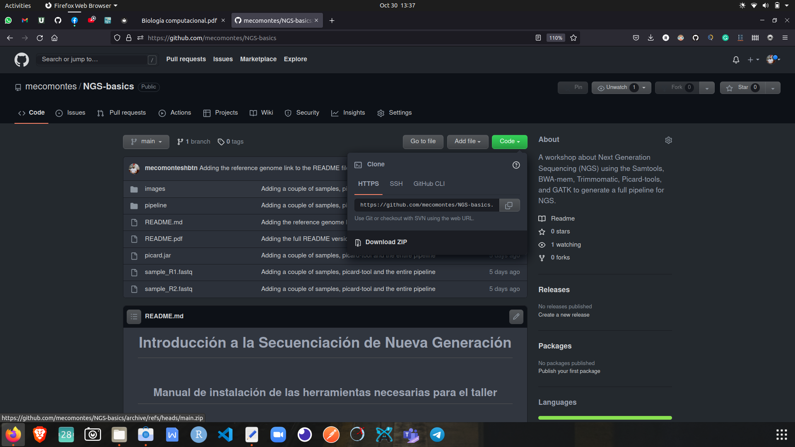

 

Este repositorio se creó con el fin de servir como una guía completa para introducirse en el mundo del análisis de secuencias genómicas comunmente conocido como genémica computacional. Acá encontrarás una presentación llamada "Biología Computacional" donde se presentan algunas de las diferentes ramas que existen en el mundo de la biología computacional (Bioinformática) mostrando algunos ejemplos de aplicación. La segunda presentación llamada "NGS Intro" está dividida en en 2 sesiones: El primer módulo es una introducción básica a la linea de comandos (CLI: Command Line Interface, o simplemente Shell o terminal) para que se familiaricen con el ambiente de trabajo. El segundo módulo, el que más nos interesa, explica cada unos de los pasos más comunes en un pipeline de análisis de secuencias genómicas, los comandos usados, y cómo ejecutarlos.
 
 
Se recomienda realizar el módulo 1 con el fin de tener los conocimeintos básicos de manejo de terminal antes de continuar con el proceso de instalación de los paquetes y herramientas necesarias para ejecutar el pipeline propuesto en el módulo 2 de la presentación.

<h2 align=left><b>Actualizar el sistema e instalar paquetes</b></h2>

Para llear a cabo el taller de la forma más fluida posible, y evitar al máximo los contratiempos, es recomendable tener instaladas las herramientas que se van a usar. Durante el taller, se explicará el uso de cada una de estas, así como la razón de por que incluirlas en un pipeline de NGS para determinar su conveniencia a la hora de implementarla en un caso real.

 
<h3 align=left><b>Actualizar el sistema</b></h3>
<pre><code>sudo apt update && sudo apt upgrade</code></pre>
<h3 align=left><b>Descargar el repositorio en Linux desde la terminal</b></h3>
<pre><code>wget "https://github.com/mecomontes/NGS-basics.git"</code></pre>
<h3 align=left><b>Descomprimir el archivo .zip descargado</b></h3>
<pre><code>unzip NGS-basics.zip</code></pre>
<h3 align=left><b>Moverse dentro de la carpeta con el pipeline descargado del repositorio</b></h3>
<pre><code>cd NGS-basics/pipeline</code></pre>
<h2 align=left><b>Instalar Trimmomatic</b></h2>
 

Trimmomatic realiza una variedad de tareas de recorte para Illumina paired-end y datos de un solo extremo. Es una herramienta de preprocesamiento de pares optimizada para los datos de secuenciación de próxima generación (NGS) de Illumina.
El software incluye varios pasos de procesamiento para el recorte y filtrado de la lectura. Utiliza una arquitectura basada en tuberías que permite aplicar "pasos" individuales (eliminación de adaptadores, filtrado de calidad, etc.) a cada par de lectura/lectura, en el orden especificado por el usuario.

<pre><code>sudo apt install trimmomatic</code></pre>

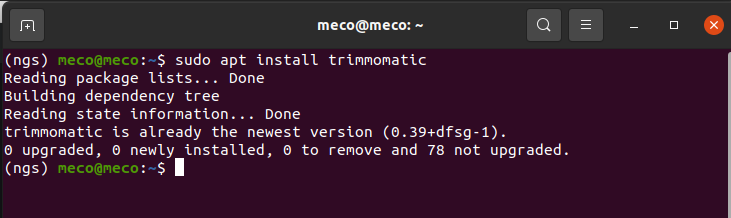

 
<h2 align=left><b>Instalar Samtools</b></h2>
 

SAMtools es un conjunto de utilidades para interactuar y posprocesar alineaciones cortas de lectura de secuencias de ADN en los formatos SAM (Sequence Alignment/Map), BAM (Binary Alignment/Map) y CRAM, escritas por Heng Li. Estos archivos son generados como salida por alineadores de lectura corta como BWA.
Se proporcionan herramientas simples y avanzadas que soportan tareas complejas como la llamada de variantes y la visualización de alineaciones, así como la clasificación, la indexación, la extracción de datos y la conversión de formatos.

<pre><code>sudo apt install samtools</code></pre>

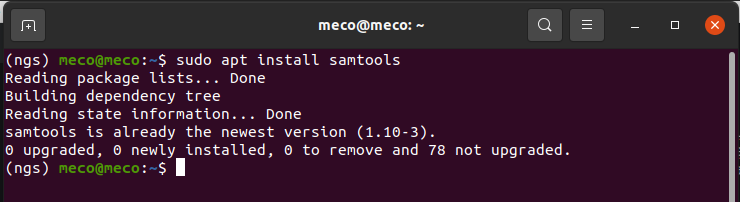

 
<h2 align=left><b>Instalar BWA</b></h2>
 

BWA es un paquete de software para mapear secuencias de ADN contra un gran genoma de referencia. Consta de tres algoritmos: BWA-backtrack, BWA-SW y BWA-MEM. El primer algoritmo está diseñado para lecturas de secuencias de Illumina de hasta 100 pb, mientras que los dos restantes para secuencias más largas oscilaron entre 70 pb y unas pocas megabases. BWA-MEM y BWA-SW comparten características similares, como la compatibilidad con lecturas largas y alineación quimérica, pero generalmente se recomienda BWA-MEM, que es la última, ya que es más rápida y precisa. BWA-MEM también tiene un mejor rendimiento que BWA-backtrack para lecturas de Illumina de 70-100 pb.
 
 
Para todos los algoritmos, BWA primero necesita construir el índice FM para el genoma de referencia (el comando de índice). Los algoritmos de alineación se invocan con diferentes subcomandos: aln/samse/sampe para BWA-backtrack, bwasw para BWA-SW y mem para el algoritmo BWA-MEM.

<pre><code>sudo apt -y install bwa
sudo apt update && sudo apt upgrade</code></pre>

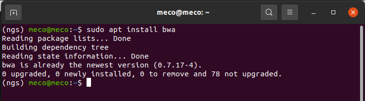

 
<h2 align=left><b>Instalar Java</b></h2>
 

Java es una plataforma informática de lenguaje de programación creada por Sun Microsystems en 1995. Ha evolucionado desde sus humildes comienzos hasta impulsar una gran parte del mundo digital actual, ya que es una plataforma fiable en la que se crean muchos servicios y aplicaciones.
 
 
Los nuevos e innovadores productos y servicios digitales diseñados para el futuro también siguen basándose en Java.Aunque la mayoría de aplicaciones Java modernas combinan el tiempo de ejecución y la aplicación de Java, todavía existen algunas aplicaciones e incluso sitios web que no funcionan sin instalar Java para escritorio. El sitio web Java.com está pensado para consumidores que todavía necesitan Java en sus aplicaciones de escritorio, sobre todo las aplicaciones que tienen como destino Java 8.
 
 
Algunas de las herramientas que se usarán en el taller fueron creadas en este lenguaje de programación, por lo que será necesario intalar el Java Runtime Environment -JRE- y el Java Development Kit -JDK- para que estas puedan correr sin problema alguno.

<pre><code>sudo apt install default-jre
sudo apt update && sudo apt upgrade
sudo apt install default-jdk
</code></pre>

Actualizar, y verificar las versiones de Java instaladas

<pre><code>sudo apt update && sudo apt upgrade
java --version
javac --version
</code></pre>

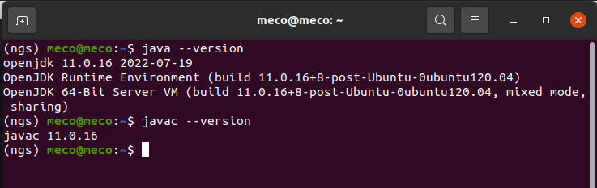

Verificar que la variable JAVA_HOME se encuentre entre las variables de ambiente

<pre><code>echo $JAVA_HOME
</code></pre>

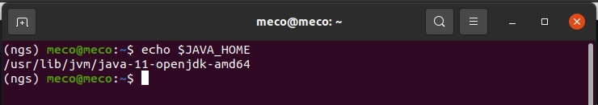

En caso de no obtener una salida similar a la anterior cuando se llama la variable JAVA_HOME, esta puede agregarse a las variables de ambiente así:

<pre><code>export JAVA_HOME="/usr/lib/jvm/java-11-openjdk-amd64"
</code></pre>
 
<h2 align=left><b>Instalar Picard tools</b></h2>
 

Picard Tools es un conjunto de herramientas creado en Java que corre en bajo linea de comandos para manipular archivos con extensión SAM, BAM, y VCF. La lista completa con una breve descripción se puede obtener ejecutando en la terminal el comando: PicardCommandLine -h.
Se puede observar la descripción de las opciones y parámetros de todos los comandos ejecutando: PicardCommandLine COMMAND -h.

<pre><code>sudo apt install -y picard-tools</code></pre>

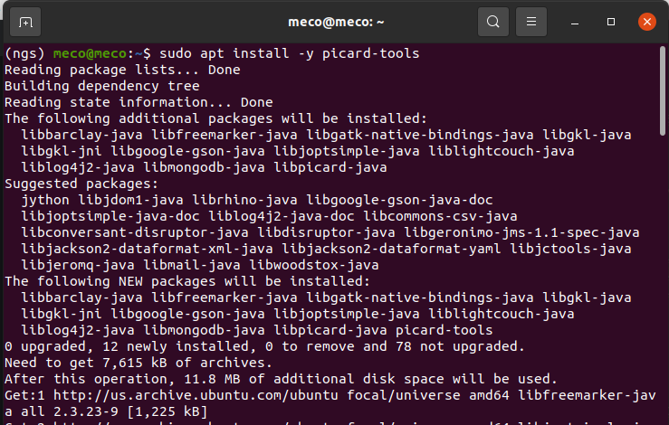

 
<h2 align=left><b>Instalar GATK</b></h2>

GATK (Genome Analysis Toolkit). Es una colección de herramientas que se ejecutan bajo la linea de comandos usada para el análisis de secuencias de datos genómicos enfocado en el descubrimeinto de variantes. Se puede usar para crear un pipeline completo o en combinación con otras herramientas.
 
 
Descargar GATK:

<pre><code>wget "https://github.com/broadinstitute/gatk/releases/download/4.3.0.0/gatk-4.3.0.0.zip"
</code></pre>

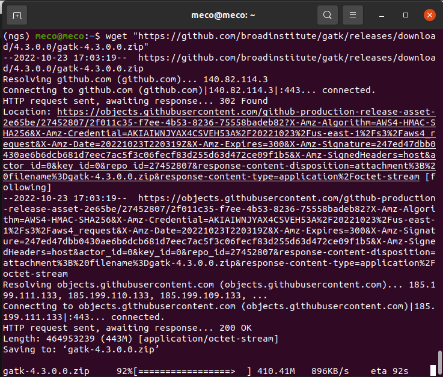

Descomprimir GATK:

<pre><code>unzip gatk-4.3.0.0.zip
</code></pre>

Exportar su ubicación y crear un alias para gatk:

<pre><code>export PATH="$PWD/gatk-4.3.0.0/:$PATH"
alias gatk="$PWD/gatk-4.3.0.0/gatk"
</code></pre>

Verificar que GATK esté funcionando:

<pre><code>gatk --help</code></pre>

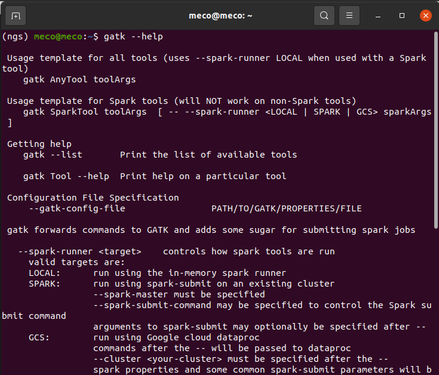

 
<h3 align=left>Descargar el genóma de referencia:</h3>
<pre><code>wget "https://api.ncbi.nlm.nih.gov/datasets/v1/genome/download?filename=GCF_000001405.40.zip&ncbi_phid=D0BD1B5805C60E4500003FAC45697196.1.m_3.032"
</code></pre>
<h3 align=left>Mover y renombrar el Genoma de referencia a la carpeta input</h3>
<pre><code>mv GCF_000001405.40.zip ./input/hg38.zip</code></pre>
<h3 align=left>Descomprimir el genóma de referencia:</h3>
<pre><code>unzip hg38.zip
</code></pre>
<h3 align=left>Correr cada paso del pipeline</h3>

Cada uno de los pasos del pipeline descrito en el módulo 2 de la presentación NGS Intro, se encuentran dentro de la carpeta pipeline con el nombre de cda paso. Por ejemplo, el primer paso es remover los primers usados usando el paquete Trimmomatic comando que se encuentra dentro del archivo llamado "01_Trimmomatic.sh". Este paso puedes correrlo anteponiendo "./" al nombre del archivo. El "./" indica que el archivo se encuentra en la carpeta actual por lo que debes estar ubicado en la carpeta pipeline dentro de la carpeta NGS Intro.

<pre><code>./01_Trimmomatic.sh</code></pre>